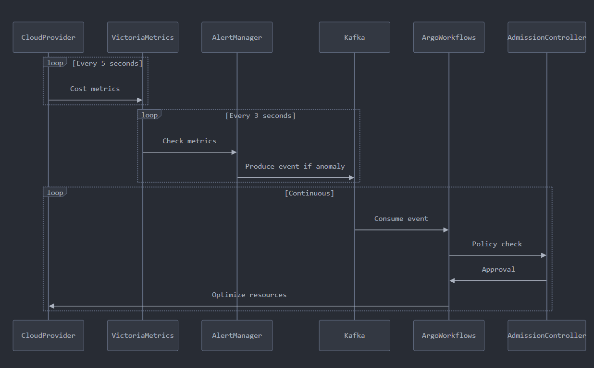

# **Cloud Cost Optimization System**

## **Overview**
This project demonstrates a cloud cost optimization system that simulates Atlan's architecture to monitor, analyze, and optimize cloud costs in real-time. It showcases the integration of various components such as cloud providers, time-series databases, event streaming, automation workflows, and alerting mechanisms.

The system is designed to:
1. Detect cost anomalies from cloud provider data.
2. Trigger automated workflows to optimize resources.
3. Provide detailed insights into cost trends and optimization actions.

---

## **Project Structure**

### **Files and Artifacts**
1. **`Atlan_seq.png`**  
   - A sequence diagram that illustrates the end-to-end flow of the system, from data collection to resource optimization.
   - It shows how components like VictoriaMetrics, Kafka, Argo Workflows, and Alertmanager interact.

2. **`Atlan.png`**  
   - An Architecture diagram representing the key entities in the system (e.g., CloudProvider, CostMetric, Anomaly) and their relationships.
   - Useful for understanding the data model and entity interactions.

3. **`documentation.pdf`**  
   - A comprehensive document explaining the system design, architecture decisions, implementation details, and expected outcomes.
   - Includes a high-level overview of how Atlan's architecture is leveraged for this solution.

4. **`demo.py`**  
   - A Python script simulating the entire workflow:
     - Collecting cost metrics from cloud providers.
     - Detecting anomalies based on thresholds.
     - Producing events into a simulated Kafka topic.
     - Triggering automated workflows for cost optimization.
   - The script uses asynchronous programming (`asyncio`) to simulate real-time operations.

5. **This README.md**  
   - Explains the project structure, purpose, and steps to run the demo.

---

## **System Design**

### **Sequence Diagram**


The sequence diagram (`Atlan_seq.png`) illustrates how the system works:
1. Cloud providers send cost metrics to VictoriaMetrics.
2. VictoriaMetrics detects anomalies and forwards them to Alertmanager.
3. Alertmanager produces events into Kafka when thresholds are breached.
4. Kafka triggers Argo Workflows for automated resource optimization.
5. Admission Controller validates workflows before applying changes to cloud resources.

---

## **How It Works**

### Workflow
1. **Data Collection**:  
   Cost metrics are collected from simulated cloud provider APIs (AWS/Azure/GCP) at regular intervals.
   
2. **Anomaly Detection**:  
   Metrics are analyzed against predefined thresholds. If costs exceed thresholds, an anomaly is detected.

3. **Event Streaming**:  
   Detected anomalies are published as events into a Kafka-like stream for further processing.

4. **Automation**:  
   Events trigger Argo Workflows that execute automated optimization tasks (e.g., rightsizing instances or cleaning up unused storage).

5. **Policy Enforcement**:  
   Admission Controller ensures all optimizations comply with organizational policies before applying changes.

---

## **How to Run the Demo**

### Prerequisites
- Python 3.7 or higher
- Basic understanding of Python's `asyncio` module

### Steps
1. Clone this repository:
   ```bash
   git clone 
   cd 
   ```

2. Install dependencies (if any). This demo uses only standard Python libraries.

3. Run the Python script:
   ```bash
   python demo.py
   ```

4. Observe the output:
   - Cost metrics being collected from simulated cloud providers.
   - Alerts raised when costs exceed thresholds.
   - Automated workflows triggered for optimization tasks.

### Example Output
```plaintext
📊 [VictoriaMetrics] Stored AWS compute cost: $523.45
📊 [VictoriaMetrics] Stored AZURE storage cost: $387.12
📊 [VictoriaMetrics] Stored GCP database cost: $412.33
🚨 [AlertManager] Cost anomaly detected! {AWS compute $523.45}
🔁 [Kafka] Producing event to 'cost-events': {details...}
⚙️ [Argo Workflows] Starting argo-workflow-compute-optimization
    📉 Cost before: $523.45
    📈 Optimized cost: $418.76
🔒 [Admission Controller] Policy validation passed
```

---

## **Key Features**

1. **Real-Time Monitoring**:
   - Simulates collecting cost metrics in real-time using asynchronous programming.

2. **Anomaly Detection**:
   - Identifies cost spikes based on predefined thresholds for each cloud provider.

3. **Event Streaming**:
   - Simulates Kafka-like event production for anomaly events.

4. **Automated Optimization**:
   - Executes simulated Argo Workflows for rightsizing resources or cleaning up unused ones.

5. **Policy Enforcement**:
   - Ensures all optimizations comply with defined policies using an Admission Controller simulation.

---

## **Future Enhancements**

1. Integrate with real cloud provider APIs (e.g., AWS Cost Explorer SDK).
2. Replace simulated Kafka with an actual Kafka producer/consumer setup.
3. Use VictoriaMetrics or Prometheus as a real backend for time-series data storage.
4. Connect to an actual Argo Workflows API for executing optimizations in Kubernetes environments.
5. Implement machine learning models for more intelligent anomaly detection and forecasting.

---

## **License**
This project is licensed under the MIT License – feel free to use and modify it as needed!

---
