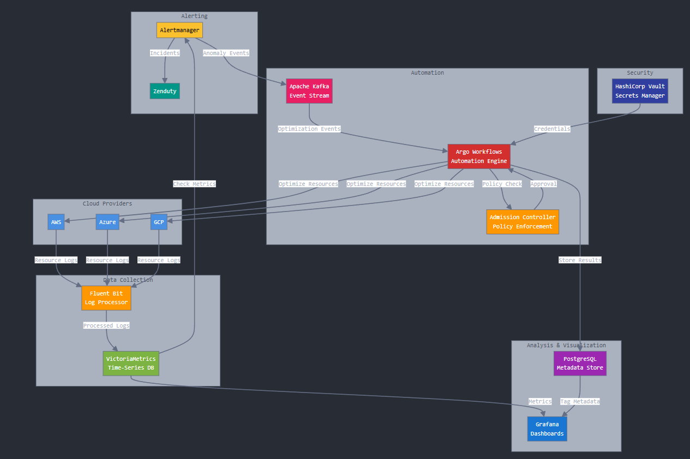
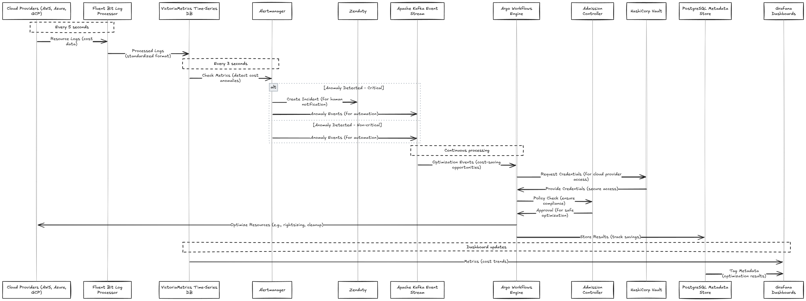

# Atlan Cloud Cost Tracker (CCT)

## Overview

This project implements a comprehensive cloud cost optimization system designed to address the challenges of monitoring, analyzing, and optimizing cloud expenses across multiple providers in real-time. The architecture provides a solution to three critical problems:

1. Detecting cost increases with minimal delay
2. Accurately identifying the sources of cost spikes
3. Providing clear paths for cost optimization

The system continuously collects cost data from AWS, Azure, and GCP, detects anomalies in real-time, and implements automated cost optimization workflows while maintaining policy compliance.

## Architecture

### Architecture Diagram



### Sequence Diagram



## System Components

The architecture integrates several specialized components to create a complete cost optimization pipeline:

### Data Collection Layer

- **Cloud Providers (AWS, Azure, GCP)**: Source systems generating resource utilization and cost data.
- **Fluent Bit Log Processor**: Collects resource logs from all cloud providers every 5 seconds and normalizes formats.


### Storage \& Monitoring Layer

- **VictoriaMetrics Time-Series DB**: Efficiently stores high-volume time-series cost data from all providers.
- **AlertManager**: Checks metrics every 3 seconds for anomalies and generates alerts when thresholds are exceeded.


### Automation Layer

- **Apache Kafka Event Stream**: Central messaging backbone that handles cost anomaly events.
- **Argo Workflows**: Orchestration engine that consumes events and automates optimization processes.
- **AdmissionController**: Validates all proposed optimization actions against organizational policies.


### Security Layer

- **HashiCorp Vault**: Securely manages credentials for accessing cloud provider APIs.


### Analysis \& Visualization Layer

- **PostgreSQL**: Stores metadata about optimization activities and results.
- **Grafana Dashboards**: Provides visualization of cost trends and optimization outcomes.


### Alerting Integration

- **Zenduty**: Provides incident management for human notification when needed.


## How It Works

The system operates through three continuous loops:

### 1. Data Collection Loop (every 5 seconds)

```
Cloud Providers → Fluent Bit → VictoriaMetrics
```

- Cloud providers generate resource logs containing cost information
- Fluent Bit collects and processes these logs into a consistent format
- Processed logs are stored in VictoriaMetrics time-series database


### 2. Anomaly Detection Loop (every 3 seconds)

```
VictoriaMetrics → AlertManager → Kafka/Zenduty
```

- AlertManager checks metrics in VictoriaMetrics for anomalies
- When detected, alerts are sent to Kafka for automated processing
- Critical incidents are also created in Zenduty for human notification


### 3. Optimization Loop (continuous)

```
Kafka → Argo Workflows → AdmissionController → Cloud Providers
```

- Argo Workflows consumes anomaly events from Kafka
- Workflows prepare optimization plans (e.g., rightsizing, cleanup)
- AdmissionController validates plans against policies
- Approved optimizations are executed against cloud providers
- Results are stored in PostgreSQL for future reference


## Cost Optimization Workflows

The system implements several types of optimization workflows:

### Resource Rightsizing

```
When: Instance CPU utilization &lt; 20% for 14+ days
Action: Downsize compute instances to appropriate size
Example: EC2 m5.xlarge → m5.large ($87.60/month savings)
```


### Idle Resource Cleanup

```
When: Storage volumes unattached for 30+ days
Action: Snapshot and delete unused volumes
Example: 12 unattached EBS volumes ($43.20/month savings)
```


### Reserved Instance Optimization

```
When: On-demand usage pattern stable for 60+ days
Action: Purchase appropriate Savings Plans
Example: 1-year commitment (24% savings on eligible compute)
```


### Storage Lifecycle Management

```
When: S3/Blob data accessed &lt; 5% in 90 days
Action: Move to lower-cost storage tiers
Example: Standard → Infrequent Access (40% storage cost reduction)
```


## Project Structure

### Files and Artifacts

- **Atlan_seq.png**
    - Sequence diagram showing the three main loops of the system
    - Illustrates timing intervals and interactions between components
- **Atlan.png**
    - Architecture diagram showing all components and data flows
    - Provides a visual representation of the complete system
- **documentation.pdf**
    - Comprehensive explanation of design decisions and trade-offs
    - Detailed component descriptions and interaction patterns
    - Proof of solution addressing the stated problems
- **demo.py**
    - Python simulation of the complete system
    - Demonstrates all three loops in action
    - Includes sample cost data and optimization workflows


## How to Run the Demo

### Prerequisites

- Python 3.7 or higher
- Docker and Docker Compose (for running containerized components)
- Basic understanding of cloud provider billing APIs


### Installation Steps

1. Clone this repository:

```bash
git clone https://github.com/Maniac1769/AtlanCCT.git
cd AtlanCCT
```

2. Install dependencies:

```bash
pip install -r requirements.txt
```

3. Configure cloud provider credentials in `.env` file
4. Start the system:

```bash
python demo.py
```


### Example Output

```
🚀 Starting Cloud Cost Tracking System Simulation
================================================
📊 [Fluent Bit] Collecting logs from AWS EC2
📊 [VictoriaMetrics] Stored AWS EC2 cost: $296.46
📊 [Fluent Bit] Collecting logs from AWS S3
📊 [VictoriaMetrics] Stored AWS S3 cost: $191.08
📊 [Fluent Bit] Collecting logs from AWS Lambda
📊 [VictoriaMetrics] Stored AWS Lambda cost: $94.02
📊 [Fluent Bit] Collecting logs from Azure VM
📊 [VictoriaMetrics] Stored Azure VM cost: $224.73
📊 [Fluent Bit] Collecting logs from Azure Storage
📊 [VictoriaMetrics] Stored Azure Storage cost: $116.04
📊 [Fluent Bit] Collecting logs from Azure Functions
📊 [VictoriaMetrics] Stored Azure Functions cost: $88.20
📊 [Fluent Bit] Collecting logs from GCP Compute
📊 [VictoriaMetrics] Stored GCP Compute cost: $273.48
📊 [Fluent Bit] Collecting logs from GCP Storage
📊 [VictoriaMetrics] Stored GCP Storage cost: $110.53
📊 [Fluent Bit] Collecting logs from GCP BigQuery
📊 [VictoriaMetrics] Stored GCP BigQuery cost: $181.42
📊 [Fluent Bit] Collecting logs from AWS EC2
📊 [VictoriaMetrics] Stored AWS EC2 cost: $280.33
📊 [Fluent Bit] Collecting logs from AWS S3
📊 [VictoriaMetrics] Stored AWS S3 cost: $142.88
📊 [Fluent Bit] Collecting logs from AWS Lambda
📊 [VictoriaMetrics] Stored AWS Lambda cost: $85.44
📊 [Fluent Bit] Collecting logs from Azure VM
📊 [VictoriaMetrics] Stored Azure VM cost: $206.14
📊 [Fluent Bit] Collecting logs from Azure Storage
📊 [VictoriaMetrics] Stored Azure Storage cost: $112.57
📊 [Fluent Bit] Collecting logs from Azure Functions
📊 [VictoriaMetrics] Stored Azure Functions cost: $69.81
📊 [Fluent Bit] Collecting logs from GCP Compute
📊 [VictoriaMetrics] Stored GCP Compute cost: $298.76
📊 [Fluent Bit] Collecting logs from GCP Storage
📊 [VictoriaMetrics] Stored GCP Storage cost: $108.82
📊 [Fluent Bit] Collecting logs from GCP BigQuery
📊 [VictoriaMetrics] Stored GCP BigQuery cost: $212.36
📊 [Fluent Bit] Collecting logs from AWS EC2
📊 [VictoriaMetrics] Stored AWS EC2 cost: $260.48
📊 [Fluent Bit] Collecting logs from AWS S3
📊 [VictoriaMetrics] Stored AWS S3 cost: $122.23
📊 [Fluent Bit] Collecting logs from AWS Lambda
📊 [VictoriaMetrics] Stored AWS Lambda cost: $104.54
📊 [Fluent Bit] Collecting logs from Azure VM
📊 [VictoriaMetrics] Stored Azure VM cost: $220.32
📊 [Fluent Bit] Collecting logs from Azure Storage
📊 [VictoriaMetrics] Stored Azure Storage cost: $113.61
📊 [Fluent Bit] Collecting logs from Azure Functions
📊 [VictoriaMetrics] Stored Azure Functions cost: $75.71
📊 [Fluent Bit] Collecting logs from GCP Compute
📊 [VictoriaMetrics] Stored GCP Compute cost: $298.79
📊 [Fluent Bit] Collecting logs from GCP Storage
📊 [VictoriaMetrics] Stored GCP Storage cost: $133.81
📊 [Fluent Bit] Collecting logs from GCP BigQuery
📊 [VictoriaMetrics] Stored GCP BigQuery cost: $325.49
🚨 [AlertManager] Cost anomaly detected! GCP BigQuery $325.49 (62.7% above baseline)
🔁 [Kafka] Producing event: {provider: "GCP", service: "BigQuery", deviation: 62.7%}
⚙️ [Argo Workflows] Starting bigquery-optimization workflow
🔑 [HashiCorp Vault] Retrieved GCP credentials
🔒 [AdmissionController] Policy validation passed
📉 [Argo Workflows] Rightsizing complete: $325.49 → $260.39 (20% reduction)
💾 [PostgreSQL] Stored optimization result for GCP BigQuery
🔔 [Zenduty] Created incident for GCP BigQuery cost spike (62.7%)
🚨 [AlertManager] Cost anomaly detected! GCP BigQuery $325.49 (62.7% above baseline)
🔁 [Kafka] Producing event: {provider: "GCP", service: "BigQuery", deviation: 62.7%}
⚙️ [Argo Workflows] Starting bigquery-optimization workflow
🔑 [HashiCorp Vault] Retrieved GCP credentials
🔒 [AdmissionController] Policy validation passed
📉 [Argo Workflows] Rightsizing complete: $325.49 → $260.39 (20% reduction)
💾 [PostgreSQL] Stored optimization result for GCP BigQuery
🔔 [Zenduty] Created incident for GCP BigQuery cost spike (62.7%)

📊 Optimization Results Summary
==============================
• GCP BigQuery: $65.10 saved
• GCP BigQuery: $65.10 saved

Total estimated monthly savings: $130.19

📈 [Grafana] Updated cost optimization dashboard with latest results
```


## System Benefits

- **Real-Time Detection**: Identifies cost anomalies within seconds instead of days or weeks
- **Clear Attribution**: Pinpoints exactly which resources are driving cost increases
- **Automated Optimization**: Implements cost-saving measures without manual intervention
- **Policy Compliance**: Ensures all optimizations follow organizational guidelines
- **Comprehensive Visibility**: Provides dashboards and historical data for all cost activities


## Future Enhancements

- Machine learning-based anomaly detection to replace static thresholds
- Predictive cost forecasting to anticipate future spending
- Integration with infrastructure as code systems for preventative optimization
- Enhanced multi-cloud optimization strategies


## License

This project is licensed under the MIT License - see the LICENSE file for details.
